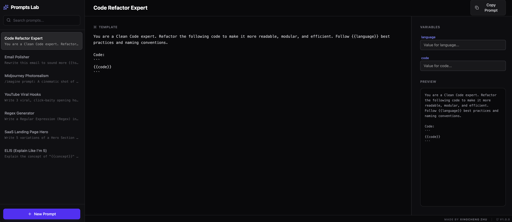

<div align="center">

  # 🧪 AI Prompts Lab
  
  **Your personal laboratory for crafting, managing, and testing AI prompts.**
  <br>
  **极客风的 AI 提示词管理与变量测试工具**

  [](https://react.dev)
  [](https://tailwindcss.com)
  [](https://github.com/xingchengzhu/prompts-lab)
  
  <br>
  
  [**🚀 Live Demo / 在线体验**](https://prompts-lab-two.vercel.app)
  
  <br>
</div>

---



## 📖 Introduction

**AI Prompts Lab** is a local-first productivity tool designed for developers, marketers, and prompt engineers. 

Stop rewriting the same prompts over and over. Use **Variables** (e.g., `{{language}}`, `{{tone}}`) to create reusable templates, fill in the blanks, and copy the perfect prompt to your clipboard instantly.

**AI Prompts Lab** 是一个本地优先的生产力工具。停止重复手写相同的提示词，使用 **变量**（如 `{{language}}`）创建可复用的模版，填空即生成，效率倍增。

## 📚 Use Cases (使用案例)

Here are some examples of how you can use Prompts Lab:

### 👨‍💻 Coding Assistant
> **Template:** "Refactor the following code to follow {{language}} best practices and improve {{metric}}:\n\n```\n{{code}}\n```"
>
> **Variables:** `language` (e.g., Python), `metric` (e.g., readability), `code`

### 🎨 Midjourney Art Generator
> **Template:** "A cinematic shot of {{subject}}, {{lighting}} lighting, in the style of {{artist}}, 8k resolution, unreal engine 5 render."
>
> **Variables:** `subject` (e.g., a cyberpunk samurai), `lighting` (e.g., neon), `artist` (e.g., Syd Mead)

### 📧 Cold Email Outreach
> **Template:** "Write a cold email to {{company}} proposing a partnership about {{topic}}. Keep the tone {{tone}} and mention their recent news about {{news}}."
>
> **Variables:** `company`, `topic`, `tone` (e.g., professional yet friendly), `news`

### 📱 Social Media Manager
> **Template:** "Generate 5 viral tweet hooks about {{topic}}. Target audience is {{audience}}. Include emojis."
>
> **Variables:** `topic` (e.g., productivity hacks), `audience` (e.g., college students)

## ⚡ Features

* **🧩 Variable Support:** Define dynamic slots like `{{code}}` or `{{topic}}` in your prompts.
* **💾 Auto-Save:** All data is stored locally in your browser. No database, no login.
* **🔍 Fuzzy Search:** Instantly find any prompt using Fuse.js.
* **⚡ Live Preview:** See your final prompt update in real-time as you fill variables.
* **🌑 Dark Mode:** A sleek, developer-friendly interface.

## 📦 Getting Started

1.  **Clone the repository**
    ```bash
    git clone [https://github.com/xingchengzhu/prompts-lab.git](https://github.com/xingchengzhu/prompts-lab.git)
    cd prompts-lab
    ```

2.  **Install dependencies**
    ```bash
    npm install
    ```

3.  **Run development server**
    ```bash
    npm run dev
    ```

## 🛠️ Tech Stack

* **Core:** React 19 + Vite
* **State:** Zustand (with LocalStorage persistence)
* **Styling:** Tailwind CSS v4
* **Search:** Fuse.js
* **Icons:** Lucide React

## 📄 License

MIT License.

---
<div align="center">
  <sub>Built with ❤️ by <a href="https://github.com/xingchengzhu">Xingcheng Zhu</a></sub>
</div>